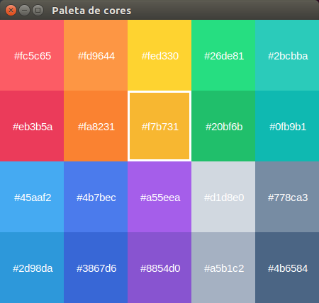

# Paleta_de_cores
Paleta de cores 5x4 em Python usando a biblioteca Tkinter. Ela usa uma lista de imagens e um loop para __mapear__ a criação da paleta.

# Créditos
Eu usei as cores disponíveis no site flatuicolors:
https://flatuicolors.com/palette/de

O Autor dessa paleta é o Martin David
https://dribbble.com/srioz
